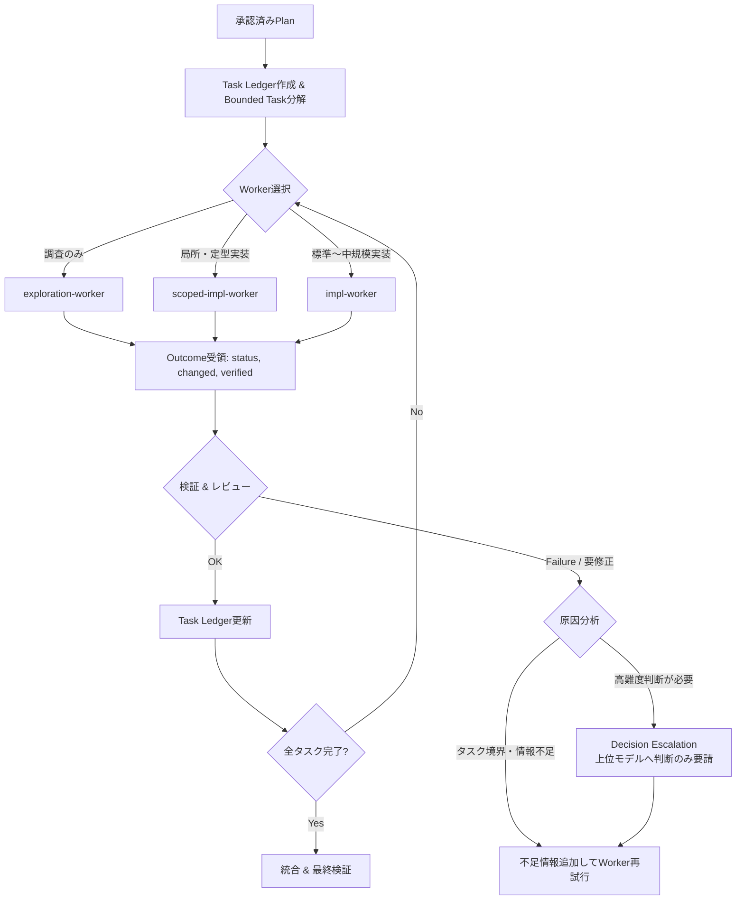

# サブエージェント駆動実装

承認済みPlanを境界の明確なタスクへ分解し、適切なWorkerへ委譲する。Execution Orchestratorのコンテキストと推論能力は、実装そのものよりオーケストレーション、境界管理、設計判断の仲介、リスクベース検証、統合に集中させる。

## コア原則

- **Orchestrator is a coordinator, not the default implementer.**（親は調整役であり、既定の実装者ではない）
- **Delegate bounded work and bounded context.**（境界づけられたタスクと必要最小限のコンテキストだけを渡す）
- **Escalate decisions, not entire tasks.**（タスク丸投げではなく、判断事項のみを圧縮して上位モデルへエスカレーションする）
- **Verify outcomes instead of reproducing worker reasoning.**（Workerの思考を最初からなぞるのではなく、客観的な検証結果と成果物を確認する）
- **Use the cheapest capable model for each responsibility.**（各責務に対して必要十分かつ最も低コストなモデルを割り当てる）

## 役割

| 担当 | 使う条件 | 主な責務 |
| --- | --- | --- |
| `exploration-worker` | 調査のみ、影響範囲・既存パターン・関連ファイルの特定 | 読み取り中心の探索とコンパクトな報告 |
| `scoped-implementation-worker` | 狭いスコープ、明確な完了条件、既存パターン踏襲、大きな設計判断不要 | 局所実装とセルフ検証 |
| `implementation-worker` | 通常〜中規模、複数ファイル・複数レイヤー、デバッグや推論が必要 | 標準実装とセルフ検証 |
| `Execution Orchestrator` | Plan理解、タスク分解、Worker選択、進行管理、統合、最終検証 | 実装全体の進行と統合品質の責任 |
| 上位モデル（Sol等） | アーキテクチャ判断、要件解釈、重大なトレードオフ、高リスク判断 | 決定・根拠・制約事項の返答（Decision解決） |

> **Note**: Execution Orchestratorは低コストモデル（例: `gpt-5.6-luna` + `xhigh`）を標準候補とする。SolをOrchestratorとして利用する場合も、同一のトークン規律（探索・実装・ルーチンレビューの委譲）を厳格に適用する。

## コンテキスト管理規律

### 1. Active Contextの極小化（Task Ledger）
Plan全文や過去Workerの詳細ログをセッション中ずっと保持・再参照しない。実装開始時にPlanを読み込んだら、以降はコンパクトな **Task Ledger** で進行管理する。

| Task | Owner | Status (pending/in-progress/done/blocked) | Verification | Decision Needed |
| --- | --- | --- | --- | --- |

完了済みタスクの内部推論や一時ログはActive Contextから切り離し、後続タスクに必要なインターフェースや確定仕様のみをLedgerに残す。

### 2. WorkerへのBounded Context提供
Workerへ渡すコンテキストは最小限に絞る。

- **渡すもの**: objective, scope, relevant files, constraints, acceptance criteria, ownership, verification, 依存する先行タスクの結果（インターフェース定義等）
- **渡さないもの**: 親の完全な会話履歴、Plan全文、他Workerの完全な作業ログ、無関係なリポジトリ情報

### 3. WorkerからのOutcome形式制限
Workerは長い探索過程や推論ログを親へ返さず、以下の共通契約形式でOutcomeのみを返す。

```text
status: done / blocked / needs-decision
changed: 変更したファイル一覧
verified: 実行した検証コマンドとその結果（pass/fail）
decisions: 実装中に行った局所判断（あれば）
blockers: ブロッカーや未解決事項（あれば）
```

### 4. Decision Escalation（判断のエスカレーション）
下位モデルで解決不能な問題が発生しても、タスク全体やリポジトリ全文を上位モデル（Sol等）へ渡さない。以下の形式に圧縮して判断を仰ぐ。

- **decision**: 判断すべき論点
- **relevant facts**: 判断に必要な最小限の事実
- **options**: 取りうる選択肢
- **recommendation**: 現時点の推奨案
- **impact**: 選択による影響範囲

上位モデルは原則として `decision + short rationale + constraints` のみを返し、Execution Orchestratorはその判断を受け取ってタスクを再開する。

## 実行フロー



### 1. Plan読込とLedger初期化
Planの完了条件、コンポーネント境界、検証要件を確認し、Task Ledgerを初期化する。

### 2. bounded taskへ分解する
1つのWorkerが自己完結できる粒度に切り出す。「機能全体の実装」のような曖昧・複合的なタスクは禁止する。

### 3. Workerを選択・委譲する
1. 調査のみ、または実装前情報収集: `exploration-worker`
2. 狭く明確で既存パターンに沿える実装: `scoped-implementation-worker`
3. 複数ファイル・複数レイヤーにまたがる通常〜中規模実装: `implementation-worker`

### 4. リスクベースの検証とレビュー
OrchestratorはWorkerの思考を最初からなぞるような探索・コード読解の重複実行を避ける。検証は客観的エビデンスを優先する。

1. **自動検証（最優先）**: build, tests, compiler / type check, lint / static analysis
2. **Acceptance Criteria確認**: タスクの受入基準が満たされているか
3. **リスクベースのレビュー**:
   - *trivial / mechanical*: 自動検証のみで完了
   - *local / normal*: 軽量レビュー（scoped / local check）
   - *complex implementation*: 標準レビュー（構造・エラーハンドリング・他機能との整合性）
   - *architecture / security / system-level*: 上位モデルによる局所レビューまたはDecision Escalation

問題がある場合は、具体的な失敗証拠・期待値を添えて元のWorkerへ修正させる（Orchestratorが全面的に書き直さない）。

### 5. 統合と最終検証
全タスク完了後、Orchestratorが統合状態を確認し、ビルド、関連テスト、lint、静的解析などシステム全体の最終検証を行う。

## 失敗・ブロッカーへの対処規律

Workerが失敗した場合、**安易にモデルのランクを上げない**（「Luna失敗→即Terra」「Terra失敗→即Sol」のような機械的フォールバックは禁止）。

1. **concrete failure evidenceを取得**: テスト失敗ログ、型エラー、期待と実際の差異を確認する。
2. **task boundaryとコンテキストの確認**: スコープが広すぎないか、必要な前提・制約が欠けていないか確認する。
3. **不足情報を補って再試行**: タスクを細分化するか、不足コンテキストを追加して同一Workerで再試行する。
4. **Worker capabilityの変更**: 明らかに推論・探索能力が不足している場合のみWorkerランクを上げる。
5. **Decision Escalation**: 仕様の曖昧さや設計トレードオフに起因する場合のみ、判断事項を圧縮して上位モデルへエスカレーションする。

## Orchestratorが直接実装できる例外

- 数行程度の接続・調整コード
- Worker成果物をつなぐ軽微なインポート修正や設定変更
- 委譲オーバーヘッドが明らかに上回る微小な修正

「自分で書いた方が早い」「自分が上位モデルだから」という理由で、探索・実装・テストを抱え込まない。

## Codexでの推奨モデルマッピング

Worker名とモデル割り当ては直交させて管理する。

| 役割 | 推奨モデル | reasoning effort | 主な用途 |
| --- | --- | --- | --- |
| `exploration-worker` | `gpt-5.6-luna` | low / medium | コードベース調査、参照パターン特定、ログ調査 |
| `scoped-implementation-worker` | `gpt-5.6-luna` | high / xhigh | 単一ファイル・局所変更、テスト追加、機械的リファクタ |
| `implementation-worker` | `gpt-5.6-terra` | medium / high | 複数ファイル変更、状態管理、複雑なビジネスロジック |
| `Execution Orchestrator` | `gpt-5.6-luna` (標準候補) / `gpt-5.6-sol` | xhigh (Luna時) / 必要最小限 (Sol時) | 全体オーケストレーション、Ledger管理、統合検証 |
| Architecture / Decision | `gpt-5.6-sol` | high / xhigh | Decision Escalation時のアーキテクチャ判断・高リスク評価 |

> **Selection Principle**: タスクの規模が大きい場合でも、Planと境界が明確であれば「Luna xhighによるOrchestration + Worker分割」を優先する。「タスクが大きいから」という理由だけでSol Orchestratorを選択しない。

## よくある誤り

- OrchestratorがWorkerの探索や実装を最初からなぞって二重作業する
- Workerに親の全履歴やPlan全文を渡し、コンテキストを浪費する
- Workerが作業ログや思考過程をそのまま親へ返し、親のコンテキストを圧迫する
- 問題発生時にタスク全体を上位モデルへ丸投げする（DecisionではなくTaskを渡す）
- 失敗時にタスク境界や前提を見直さず、即座にモデルランクを上げる
- 「自分がSolだから」とOrchestratorが実装・探索・テストを直接抱え込む
